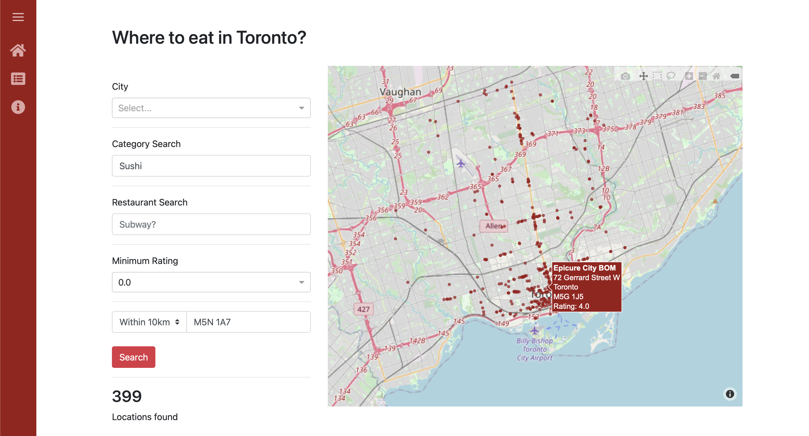
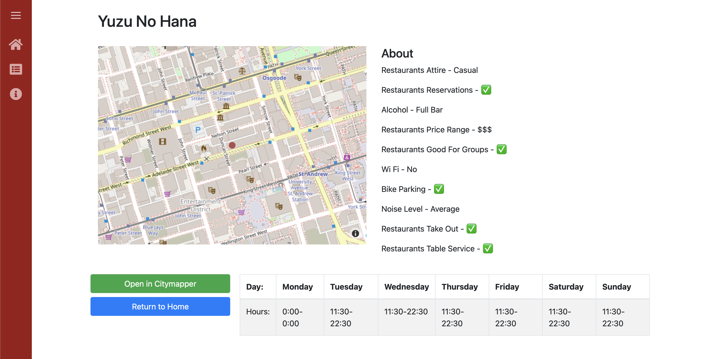

# Restaurant Recommendation App

Making use of the [Yelp open-source data set][0], this app provides a restaurant recommendation service for the Toronto
area. You are able to search by town, restaurant category, rating and distance from a specified location. The app then
gives recommendations of restaurants that fit those parameters, ranking them according to both their rating and number
of reviews. You can then get directions from Citymapper to the location.

## Screenshots






## Requirements

You will need to download the dataset from the link above, and convert it to a readable `json` format via 
`data_converter/convert_raw_data.py` 

For the 'Within X km' functionality, you will need to create a `access-keys.yaml` file in the main directory
containing the following
```yaml
position-stack: <your-access-key>
```
A free access key can be created on Position Stack [here][1]

[0]: https://www.yelp.com/dataset
[1]: https://positionstack.com/signup/free
